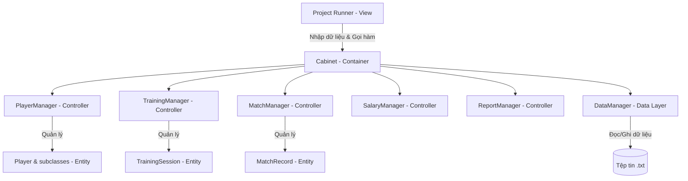

# Fooball_Player_Manager_System
# Football Player Management System (Hệ thống Quản lý Cầu thủ Bóng đá)

Dự án cuối khóa môn **PRO192 (Lập trình hướng đối tượng với Java)** tại Đại học FPT. Hệ thống được xây dựng hoàn toàn bằng ngôn ngữ Java SE, áp dụng mô hình thiết kế **MVC (Model-View-Controller)** và cơ chế lưu trữ tệp tin phẳng (Flat Files) để quản lý thông tin cầu thủ, lịch tập luyện, điểm danh, thống kê trận đấu và tự động tính toán lương thưởng.

---

## 1. Giới Thiệu & Kiến Trúc Hệ Thống (MVC)

Hệ thống tuân thủ nghiêm ngặt nguyên lý hướng đối tượng (OOP) nâng cao và mô hình MVC để phân tách rõ ràng trách nhiệm giữa các lớp xử lý dữ liệu và giao diện điều khiển:

### Sơ đồ luồng hoạt động MVC


### Chi tiết các tầng thành phần:
*   **Model (Entity):** Đóng gói thực thể dữ liệu, tự động kiểm tra tính hợp lệ của thuộc tính (Data Validation) và thực hiện các tính toán nội bộ.
*   **Controller:** Quản lý tập hợp danh sách các thực thể trong bộ nhớ RAM, triển khai các thuật toán xử lý nghiệp vụ chính độc lập với giao diện nhập xuất.
*   **View (Runner):** Nhận tương tác CLI từ người dùng, lọc dữ liệu thô và truyền vào các hàm nghiệp vụ của Controller.
*   **Data Layer (DataManager):** Phụ trách cơ chế lưu trữ lâu dài (Persistence), tự động đọc/ghi dữ liệu từ file văn bản (.txt) mỗi khi có giao dịch thành công.

---

## 2. Đặc Tả Chi Tiết Gói Mã Nguồn (Package Structure)

Hệ thống được tổ chức thành các gói rõ ràng như sau:

```text
src/
├── entity/                 # Tầng thực thể (Model)
│   ├── Player.java         # Lớp trừu tượng định nghĩa các thuộc tính cơ bản của cầu thủ
│   ├── RegularPlayer.java  # Lớp con biểu diễn cầu thủ thường (Tính thưởng hệ số 200,000)
│   ├── StarPlayer.java     # Lớp con biểu diễn cầu thủ ngôi sao (Tính thưởng hệ số 500,000)
│   ├── TrainingSession.java# Biểu diễn một buổi tập luyện
│   ├── AttendanceRecord.java# Bản ghi điểm danh (Map cầu thủ - Trạng thái vắng/mặt)
│   ├── MatchRecord.java    # Bản ghi thông tin trận đấu diễn ra
│   └── PerformanceRecord.java# Thống kê hiệu suất chi tiết của một cầu thủ trong trận
├── controller/             # Tầng điều khiển nghiệp vụ (Controller)
│   ├── Cabinet.java        # Khởi tạo gom toàn bộ các quản lý nghiệp vụ
│   ├── PlayerManager.java  # Điều khiển thêm/sửa/tìm kiếm cầu thủ
│   ├── TrainingManager.java# Điều khiển lên lịch tập & điểm danh chụp ảnh trạng thái (Snapshot)
│   ├── MatchManager.java   # Điều khiển quản lý trận đấu & cập nhật hiệu suất cầu thủ
│   ├── SalaryManager.java  # Tính tổng điểm hiệu suất & lương tháng
│   └── ReportManager.java  # In báo cáo tổng hợp lương & bảng xếp hạng Vua phá lưới
├── data/
│   └── DataManager.java    # Đọc và ghi dữ liệu ra các file văn bản lưu trữ
├── util/
│   ├── Menu.java           # Lớp tiện ích quét và kiểm tra dữ liệu nhập từ bàn phím Console
│   └── Notification.java   # Enum định nghĩa các mẫu thông báo/lỗi hệ thống
└── project/
    └── Project.java        # Điểm khởi chạy chương trình (Main class chứa menu CLI)
```

---

## 3. Danh Sách 15 Tính Năng Nghiệp Vụ (S1 - S15)

| Mã | Tên Chức Năng | Luồng Xử Lý & Ràng Buộc (Validation) |
|:---:|---|---|
| **S1** | Thêm mới cầu thủ | Tự động sinh ID cầu thủ dạng `PLxxxx`. Nhập Tên (chỉ chữ), Tuổi (16-45), Quốc tịch, Vị trí (GK/DF/MF/FW), Số áo (1-99), Lương cứng (&gt; 0), Loại cầu thủ và Trạng thái. Ngăn chặn trùng số áo giữa các cầu thủ Active. |
| **S2** | Cập nhật thông tin cầu thủ | Nhập ID cầu thủ. Hỗ trợ cập nhật Vị trí, Số áo, Lương cứng, Trạng thái. Ngăn chặn đổi Tên/Tuổi để đảm bảo tính pháp lý hợp đồng. |
| **S3** | Xem danh sách cầu thủ | Hiển thị tất cả cầu thủ dưới dạng bảng căn lề cột, sắp xếp tăng dần theo ID. |
| **S4** | Tìm kiếm cầu thủ | Hỗ trợ tìm kiếm theo 4 tiêu chí độc lập: Tên, Vị trí, Quốc tịch hoặc Trạng thái hoạt động. |
| **S5** | Xem chi tiết cầu thủ | Nhập ID cầu thủ và kết xuất chi tiết hồ sơ cá nhân và tiền lương cơ sở của cầu thủ. |
| **S6** | Tạo lịch tập luyện mới | Tự động sinh ID lịch tập dạng `TRxxxx`. Nhập ngày tập (dd/MM/yyyy), địa điểm và chủ đề tập luyện. |
| **S7** | Điểm danh tập luyện | Nhập ID buổi tập. Tạo bản ghi Snapshot danh sách cầu thủ Active tại thời điểm đó. Người dùng nhập mã các cầu thủ vắng mặt ngăn cách bằng dấu phẩy để cập nhật trạng thái vắng/mặt. |
| **S8** | Tạo hồ sơ trận đấu mới | Tự động sinh ID trận đấu dạng `MAxxxx`. Nhập ngày thi đấu, tên đội đối thủ và loại trận đấu (Friendly, League, Cup). |
| **S9** | Xem lịch sử tập luyện | Hiển thị toàn bộ lịch trình các buổi tập đã tạo, sắp xếp theo ID buổi tập. |
| **S10**| Xem lịch sử trận đấu | Hiển thị toàn bộ danh sách các trận đấu đã ghi nhận, sắp xếp theo ID trận đấu. |
| **S11**| Nhập/Cập nhật hiệu suất | Nhập Match ID & Player ID. Kiểm tra trạng thái cầu thủ Active. Nhận số bàn thắng, kiến tạo, thẻ vàng (0-2), thẻ đỏ (0-1), số phút (0-120). Cho phép ghi đè (Replace) nếu đã tồn tại bản ghi cũ. |
| **S12**| Tính lương cầu thủ | Nhập tháng, năm và Player ID. Quét qua lịch sử trận đấu trong tháng đó để tổng hợp điểm hiệu suất và tính tổng tiền lương + thưởng tương ứng. |
| **S13**| Báo cáo tổng hợp lương | Nhập tháng, năm. Hiển thị báo cáo chi trả lương chi tiết dạng bảng cho tất cả cầu thủ Active trong tháng đó kèm tổng chi phí của CLB. |
| **S14**| BXH Vua phá lưới | Tổng hợp số bàn thắng trong lịch sử của tất cả cầu thủ và hiển thị bảng xếp hạng giảm dần kèm theo thứ hạng Rank. |
| **S15**| Thoát hệ thống | Cung cấp lựa chọn: (1) Chỉ lưu dữ liệu hiện tại, (2) Lưu dữ liệu và thoát, (3) Thoát ngay không lưu dữ liệu, (4) Hủy lệnh quay lại menu. |

---

## 4. Các Quy Tắc Nghiệp Vụ Cốt Lõi (Business Rules - BR)

Hệ thống tích hợp sâu các quy tắc nghiệp vụ tự động tại tầng Thực thể nhằm đảm bảo tính toàn vẹn và nhất quán của dữ liệu:

*   📌 **BR4 (Tuổi tác):** Tuổi cầu thủ chuyên nghiệp bắt buộc phải nằm trong phạm vi từ **16 đến 45 tuổi**.
*   📌 **BR5 (Số áo thi đấu):** Số áo thi đấu hợp lệ phải từ **1 đến 99**. Cấm trùng số áo đối với các cầu thủ có trạng thái là **Active**.
*   📌 **BR9 (Tham gia thi đấu):** Chỉ những cầu thủ đang có trạng thái **Active** mới được phép ghi nhận hiệu suất thi đấu trong trận.
*   📌 **BR15 & BR18 (Điểm danh Snapshot):** Danh sách cầu thủ được tham gia chấm điểm danh cho một buổi tập được lưu cố định (Snapshot) dựa trên danh sách cầu thủ Active tại thời điểm buổi tập đó được tạo và chấm lần đầu. Các thay đổi về nhân sự sau đó (thêm cầu thủ mới hoặc deactive cầu thủ khác) sẽ không làm thay đổi danh sách điểm danh lịch sử của buổi tập đó.
*   📌 **BR21 (Ràng buộc số phút):** Nếu số phút thi đấu trong trận bằng **0**, các chỉ số hiệu suất khác (bàn thắng, kiến tạo, thẻ vàng, thẻ đỏ) bắt buộc phải bằng **0**.
*   📌 **BR24 (Tính điểm hiệu suất):** Điểm hiệu suất của cầu thủ trong mỗi trận được tự động tính theo công thức:
    $$\text{Điểm} = (\text{Bàn thắng} \times 5) + (\text{Kiến tạo} \times 3) - (\text{Thẻ vàng} \times 1) - (\text{Thẻ đỏ} \times 3)$$
    Nếu tổng điểm bị âm, điểm tối thiểu được gán bằng **0**.
*   📌 **BR26 (Tính lương thưởng):**
    *   **Cầu thủ thường (Regular Player):** $\text{Tổng lương} = \text{Lương cứng} + (\text{Tổng điểm tháng} \times 200,000\text{ VND})$
    *   **Cầu thủ ngôi sao (Star Player):** $\text{Tổng lương} = \text{Lương cứng} + (\text{Tổng điểm tháng} \times 500,000\text{ VND})$
